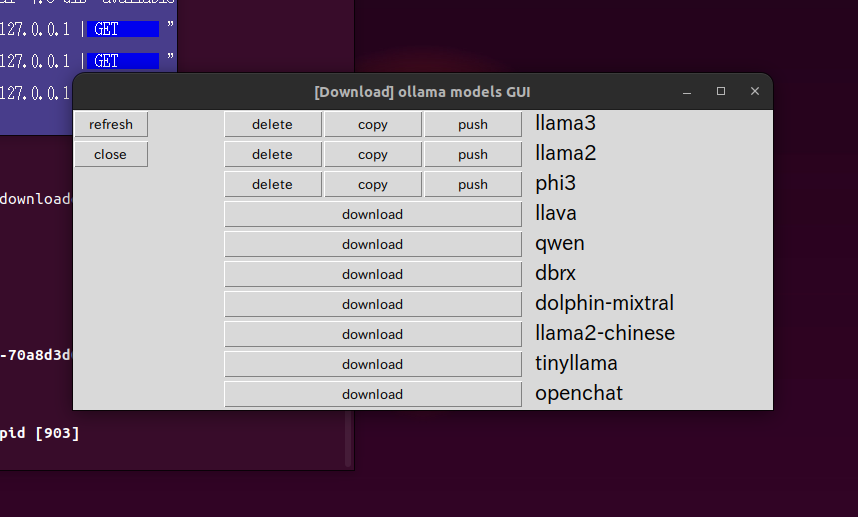
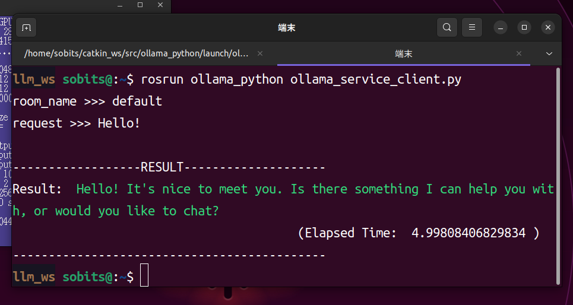

<a name="readme-top"></a>

[JP](README.md) | [EN](README_en.md)

[![Contributors][contributors-shield]][contributors-url]
[![Forks][forks-shield]][forks-url]
[![Stargazers][stars-shield]][stars-url]
[![Issues][issues-shield]][issues-url]
[![License][license-shield]][license-url]

# OLLAMA Python for ROS

<!-- 目次 -->
<details>
  <summary>目次</summary>
  <ol>
    <li>
      <a href="#概要">概要</a>
    </li>
    <li>
      <a href="#セットアップ">セットアップ</a>
      <ul>
        <li><a href="#環境条件">環境条件</a></li>
        <li><a href="#インストール方法">インストール方法</a></li>
      </ul>
    </li>
    <li>
      <a href="#実行・操作方法">実行・操作方法</a>
      <ul>
        <li><a href="#モデルのダウンロード">モデルのダウンロード</a></li>
        <li><a href="#会話をする">会話をする</a></li>
      </ul>
    </li>
    <li><a href="#マイルストーン">マイルストーン</a></li>
    <!-- <li><a href="#contributing">Contributing</a></li> -->
    <!-- <li><a href="#license">License</a></li> -->
    <li><a href="#参考文献">参考文献</a></li>
  </ol>
</details>


<!-- レポジトリの概要 -->
## 概要

本レポジトリは，オフラインのローカルのみで大規模言語モデル(LLM:Large Language Models)を動かすことができるパッケージです．\
処理速度はCPU/GPUで変わりますが，モデルによってはCPUでも問題なく動きます．\
特に，大規模言語モデルは1単語ずつ返答が構築されていく仕組みのため，呼び出しから返答までの間に途中経過が存在することから，ROSのActionlib通信を用います．

<p align="right">(<a href="#readme-top">上に戻る</a>)</p>


<!-- セットアップ -->
## セットアップ

ここで，本レポジトリのセットアップ方法について説明します．

<p align="right">(<a href="#readme-top">上に戻る</a>)</p>


### 環境条件

まず，以下の環境を整えてから，次のインストール段階に進んでください．

| System | Version |
| --- | --- |
| Ubuntu | 20.04 (Focal Fossa) |
| ROS    | Noetic Ninjemys     |
| Python | >=3.8               |

> [!NOTE]
> `Ubuntu`や`ROS`のインストール方法に関しては，[SOBITS Manual](https://github.com/TeamSOBITS/sobits_manual#%E9%96%8B%E7%99%BA%E7%92%B0%E5%A2%83%E3%81%AB%E3%81%A4%E3%81%84%E3%81%A6)を参照してください．

<p align="right">(<a href="#readme-top">上に戻る</a>)</p>


### インストール方法

1. ROSの`src`フォルダに移動します．
    ```console
    $ roscd
    # もしくは，"cd ~/catkin_ws/"へ移動．
    $ cd src/
    ```
2. 本レポジトリをcloneします．
    ```console
    $ git clone https://github.com/TeamSOBITS/ollama_python
    ```
3. レポジトリの中へ移動します．
    ```console
    $ cd ollama_python/
    ```
4. 依存パッケージをインストールします．
    ```console
    $ bash install.sh
    ```
5. パッケージをコンパイルします．
    ```console
    $ roscd
    # もしくは，"cd ~/catkin_ws/"へ移動．
    $ catkin_make
    ```

<p align="right">(<a href="#readme-top">上に戻る</a>)</p>


<!-- 実行・操作方法 -->
## 実行・操作方法

ここで，本レポジトリの実行方法について説明します．

<p align="right">(<a href="#readme-top">上に戻る</a>)</p>


### モデルのダウンロード

1. [model_download.launch](/launch/model_download.launch)を起動する
    ```console
    $ roslaunch ollama_python model_download.launch
    ```
2. GUIのから使いたいモデルをダウンロードする\
  モデルのダウンロードは[download]をクリックしてください．

> [!NOTE]
> モデルはこれが全てではなく，[こちら](https://ollama.com/library)にあるものから抜選しています．(全て書くとGUIが膨大になってしまうのと，公式からの更新に対応できないため)\

もしGUIにないものをdownloadしたい場合は，[model_downloader.py](scripts/model_downloader.py)の19行目にあるリストに追加してください．\
既にモデルがダウンロードされている場合は削除([delete])，コピー([copy])，push([push])することができます．

> [!NOTE]
> モデルのダウンロードにはしばらく時間がかかります．GUIが更新されるまで待っていてください

<div align="center">
  
</div>

> [!WARNING]
> 詳細や細かい操作方法などについては[元ollama-python](https://github.com/ollama/ollama-python)や[ollama](https://github.com/ollama/ollama)などを参照してください．

<p align="right">(<a href="#readme-top">上に戻る</a>)</p>


### 会話をする

1. [ollama.launch](launch/ollama.launch)にある`model_name`を上の[モデルのダウンロード](#モデルのダウンロード)でダウンロードしたモデルにします．
以下は，llama3を指定した一例です．
    ```xml
    <arg name="model_name" default="llama3"/>
    ```
2. Serverを起動します．
Actionlib通信を用いているため，返答文が生成されるまでの途中経過を確認できます．
    ```console
    $ roslaunch ollama_python ollama.launch
    ```
3. [任意]実際に呼び出してみましょう．
    - Actionlib通信(途中経過から得るモード)で呼び出す
      ```console
      $ rosrun ollama_python ollama_action_client.py
      ```
    - Service通信(結果だけ得るモード)で呼び出す
      ```console
      $ rosrun ollama_python ollama_service_client.py
      ```
そこで，`room_name` >>> をなんでもいいですが，ここでは`default`としてみましょう．
`request`になにか打ち込んでみましょう．ここでは一例として`Hello!`と送ってみました．

<div align="center">
  
</div>

> [!WARNING]
> CPUでは処理が遅くなってしまうため，Actionlibで途中経過を見ながら待機していたほうがいいかもしれません．

> [!NOTE]
> 事前プロンプトの設定や`room_name`についての詳細は[こちら](README_DETAILS.md)を確認してください．

<p align="right">(<a href="#readme-top">上に戻る</a>)</p>


<!-- マイルストーン -->
## マイルストーン

現時点のバッグや新規機能の依頼を確認するために[Issueページ][issues-url] をご覧ください．

<p align="right">(<a href="#readme-top">上に</a>)</p>


<!-- 参考文献 -->
## 参考文献

* [ollama](https://ollama.com/)
* [ollama-python.git](https://github.com/ollama/ollama-python)
* [ollama.git](https://github.com/ollama/ollama)
* [Models](https://ollama.com/library)

<p align="right">(<a href="#readme-top">上に戻る</a>)</p>


<!-- MARKDOWN LINKS & IMAGES -->
<!-- https://www.markdownguide.org/basic-syntax/#reference-style-links -->
[contributors-shield]: https://img.shields.io/github/contributors/TeamSOBITS/ollama_python.svg?style=for-the-badge
[contributors-url]: https://github.com/TeamSOBITS/ollama_python/graphs/contributors
[forks-shield]: https://img.shields.io/github/forks/TeamSOBITS/ollama_python.svg?style=for-the-badge
[forks-url]: https://github.com/TeamSOBITS/ollama_python/network/members
[stars-shield]: https://img.shields.io/github/stars/TeamSOBITS/ollama_python.svg?style=for-the-badge
[stars-url]: https://github.com/TeamSOBITS/ollama_python/stargazers
[issues-shield]: https://img.shields.io/github/issues/TeamSOBITS/ollama_python.svg?style=for-the-badge
[issues-url]: https://github.com/TeamSOBITS/ollama_python/issues
[license-shield]: https://img.shields.io/github/license/TeamSOBITS/ollama_python.svg?style=for-the-badge
[license-url]: LICENSE