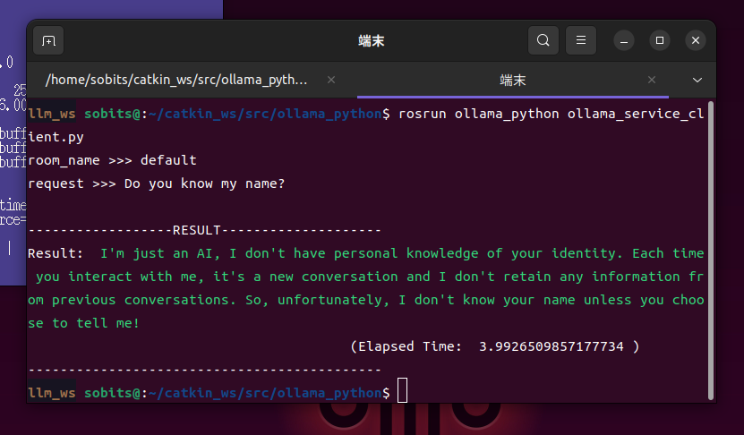
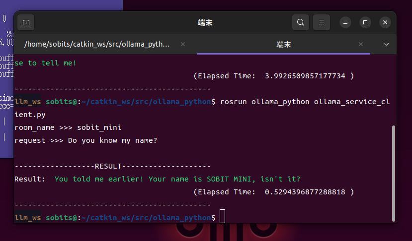

<sub>[Go back to README](README_en.md)</sub>

## Details

### Message info

Actionlib通信にて呼び出すメッセージの構成は以下のようになっています．
```sh
# Goal
string request        # Request message
string room_name      # Room name selection
bool is_service       # Feedback flag
---
# Result
string result         # Result message
float64 elapsed_time  # Result duration
---
# Feedback
string wip_result     # Mid-result message
bool end_flag         # Feedback conclusion flag
```


### About `room_name`

`room_name` is a label that assigns a stock of conversations. For example, in Chat GPT, you can switch rooms for each conversation.

Here is an example of the state:

```yaml
# Room A
USER : Tell me about SOBITS
GPT : As a large language model, I don't have knowledge about specific words.
USER : I see. SOBITS is a team composed of students from Tsui Laboratory and Hagiwara Laboratory at Soka University
GPT : Oh, I see! A joint team of two laboratories is wonderful!

# Room B
USER : Please answer questions about mathematics
GPT : Of course. What kind of math question do you have?
USER : Why can't we divide by zero?
GPT : The operation of dividing by zero is not defined mathematically, so it has no meaning.
```

Suppose there are two rooms, A and B. If the user asks "What is SOBITS?" in these two rooms, of course GPT can answer in room A. Here is an example of the answer:

```yaml
# Room A
USER : What is SOBITS?
GPT : SOBITS is what you taught me earlier. It was a joint team of Tsui Laboratory and Hagiwara Laboratory, right? Was there any mistake?

# Room B
USER : What is SOBITS?
GPT : I don't have knowledge about SOBITS. I might be able to answer if it was a math question.
```

The `room_name` in this package corresponds to Room A and Room B. You can create as many `room_name` as you want, and as long as you don't cut off the server's launch, you can continue the conversation in the room by specifying the room name you have specified in the past.


### Add a pre-promp

As mentioned above, you can define a history as if you had a conversation in advance by specifying `room_name`.
Basically, you can define it in [base_prompt.yaml](prompt/base_prompt.yaml).

Those are just an example, but I defined it as follows.

```yaml
# yaml file where you can define a conversation in advance
sobit_mini:                                         # In a room called sobit_mini...
- {user     : "My name is SOBIT MINI."}             # If the User side says "My name is SOBIT MINI",...
- {assistant: "Nice to meet you SOBIT MINI!"}       # Since we have already defined a conversation where we say "Nice to meet you, SOBIT MINI",
                                                    # you can continue the conversation from this point by specifying the room sobit_mini

team_introduce:                                     # We also have another room called team_introduce
- {user     : "Our team name is SOBITS."}
- {assistant: "I love it! SOBITS sounds like a unique and fun team name."}
- {user     : "SOBITS consists of about 30 people."}
- {assistant: "A team of 30 people! That's impressive!"}
```

In the `room_name` "sobit_mini", you can proceed with the conversation with the system recognizing the User's name as SOBIT MINI.
In another room, the `room_name` "team_introduce", we are explaining about Team SOBITS, and the system knows the team name and the number of people in the team.

Based on these, I will explain a simple operation method using rooms and pre-prompts.

1. Launch the ActionServer.
    ```console
    $ roslaunch ollama_python ollama.launch
    ```
> [!IMPORTANT]
> Do not forget to select the model in advance.

2. Launch the ActionClient.
    ```console
    $ rosrun ollama_python ollama_action_client.py
    # or
    $ rosrun ollama_python ollama_service_client.py
    ```

Please try setting `room_name` to `default` and typing "Do you know my name?" in `request`.

<div align="left">

</div>

The room named `default` is not pre-prompted and is not a room we just defined, so I think the response was "I don't know".

Please run the client again.
This time, set the `room_name` to "sobit_mini" and try setting the `request` to "Do you know my name?" in the same way.

<div align="left">

</div>

As you can see, the response might be similar to "So, your name is SOBIT MINI". This is because the conversation history is accumulated for each room, so as long as you don't cut off the server's launch, you can use it as many times as you want from the pre-prompt or continuation of the conversation, as long as you specify the room name.
